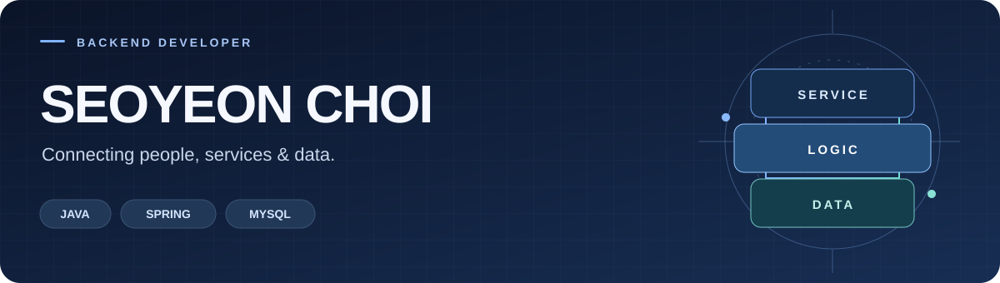
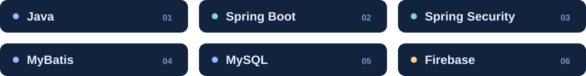

  

  <strong>사용자의 업무 흐름을 이해하고, 기능과 데이터를 연결합니다.</strong>

  <a href="#about">About</a> &nbsp; / &nbsp;
  <a href="#stack">Tech Stack</a> &nbsp; / &nbsp;
  <a href="#projects">Projects</a> &nbsp; / &nbsp;
  <a href="#experience">Experience</a>

 

## 01 &nbsp; About

안녕하세요. **Java·Spring 기반 백엔드 개발자를 준비하는 최서연**입니다.

EduPOP과 RunPT를 개발하며 **화면·서버·데이터를 연결하는 경험**을 쌓았습니다. 오류가 발생하면 요청과 데이터 흐름을 따라 원인을 파악하고, 수정한 내용이 관련 기능에도 올바르게 반영되는지 확인하려고 노력합니다.

사용자의 불편을 줄이는 기능을 만드는 데 흥미를 느끼며, 개발부터 배포·운영까지 이해의 폭을 넓혀가고 있습니다.

> **관심 분야** &nbsp; 인증·인가 · 외부 API 및 AI 기능 연동 · 서비스 배포와 운영

 

## 02 &nbsp; Tech Stack

 

| | 프로젝트에서 활용한 기술 |
| :--- | :--- |
| **Web** | `Thymeleaf` `HTML` `CSS` `JavaScript` |
| **Integration** | OAuth 2.0 기반 소셜 로그인 · REST API 연동 · LLM API 연동 |
| **Tools** | `Git` `GitHub` `IntelliJ IDEA` `Android Studio` |
| **Learning** | Linux · 네트워크 · 클라우드 및 서비스 배포 |

 

## 03 &nbsp; Selected Projects

<table>
  <tr>
    <td width="50%" valign="top">
      
01 / EDUCATION PLATFORM

      <h3><a href="https://github.com/Seo-Yeon-Choi/EduPOP">EduPOP ↗</a></h3>
      
<strong>시험의 결과를 다음 학습으로.</strong>

      
학원 운영부터 시험·복습·학습 분석까지 연결하는 교육 플랫폼

      
<code>Java</code> <code>Spring Boot</code> <code>Spring Security</code> <code>MySQL</code>

      

      
<strong>팀장 · 백엔드 개발</strong>

      <ul>
        <li>5인 팀의 일정 관리와 코드 통합</li>
        <li>인증·권한 처리 및 3사 소셜 로그인 통합</li>
        <li>시험지 생성·PDF 문항 추출</li>
        <li>사업자정보 검증·AI 유사 문제 API 연동</li>
      </ul>
      
<a href="https://github.com/Seo-Yeon-Choi/EduPOP"><strong>저장소 살펴보기 →</strong></a>

    </td>
    <td width="50%" valign="top">
      
02 / RUNNING APPLICATION

      <h3><a href="https://github.com/Seo-Yeon-Choi/RunPTApp">RunPT ↗</a></h3>
      
<strong>나의 조건에 맞는 러닝 경로.</strong>

      
희망 거리와 경사도를 반영하는 러너 맞춤형 Android 경로 서비스

      
<code>Android</code> <code>Firebase</code> <code>Backend API</code>

      

      
<strong>앱 개발 · 백엔드 연동</strong>

      <ul>
        <li>Android 앱 화면 개발</li>
        <li>거리·경사도 입력값의 서버 전달</li>
        <li>서버가 생성한 경로의 화면 표시</li>
        <li>Firebase 경로 좌표 저장 및 조회</li>
      </ul>
      
<a href="https://github.com/Seo-Yeon-Choi/RunPTApp"><strong>저장소 살펴보기 →</strong></a>

    </td>
  </tr>
</table>

 

## 04 &nbsp; How I Work

**문제의 원인을 구분하고, 함께 완성할 방법을 찾습니다.**

<strong>01 &nbsp; 같은 403 오류, 서로 다른 원인 — 인증·권한 문제 해결</strong>

EduPOP에 Spring Security를 적용한 후 여러 기능에서 403 오류가 발생했습니다.

- **확인:** 사용자 역할 값과 접근 권한 설정, 상태 변경 요청의 CSRF 토큰 전달 여부를 살폈습니다.
- **수정:** 역할 접두사를 통일하고 필요한 요청에 CSRF 토큰을 전달하도록 수정했습니다.
- **배운 점:** 같은 응답 코드도 서로 다른 원인에서 발생할 수 있어, 요청이 처리되는 흐름을 따라 문제를 구분해야 한다는 점을 배웠습니다.

<strong>02 &nbsp; 필요한 기능을 일정 안에 — 범위 조정과 협업</strong>

프로젝트 진행 중 학생별 통계 기능을 추가하자는 의견이 나왔습니다.

- **검토:** 기능의 필요성과 남은 일정을 함께 검토했습니다.
- **실행:** 기존 페이지를 재활용하는 방향으로 구현 범위를 조정하고 역할과 일정을 재분배했습니다.
- **결과:** 정해진 기간 안에 기능을 완성했습니다.

 

---

  오늘 할 수 있는 일에 최선을 다하며, 한 걸음씩 성장합니다.

<!-- 공개 URL을 확인한 뒤 Blog / Portfolio / Email 링크를 추가하세요. -->
